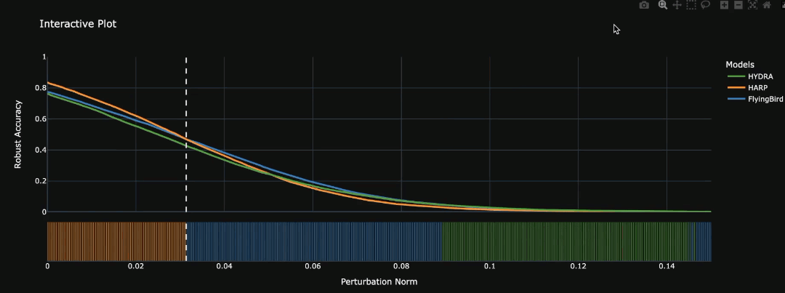

[](https://colab.research.google.com/drive/13Mb9tSXNfivOBfUJJlEuacN84dUT7jqW?usp=sharing)
[](https://arxiv.org/abs/2409.01249)
[](https://pytorch.org/)
# Adversarial Pruning: A Survey and Benchmark of Pruning Methods for Adversarial Robustness :scissors: :shield:

Recent work has proposed neural network pruning techniques to reduce the size of a network while preserving robustness against adversarial examples, i.e., well-crafted inputs inducing a misclassification. These methods, which we refer to as adversarial pruning methods, involve complex and articulated designs, making it difficult to analyze the differences and establish a fair and accurate comparison. In this work, we overcome these issues by surveying current adversarial pruning methods and proposing a novel taxonomy to categorize them based on two main dimensions: the pipeline, defining when to prune; and the specifics, defining how to prune. We then highlight the limitations of current empirical analyses and propose a novel, fair evaluation benchmark to address them. We finally conduct an empirical re-evaluation of current adversarial pruning methods and discuss the results, highlighting the shared traits of top-performing adversarial pruning methods, as well as common issues.

**Authors:**
Giorgio Piras (University of Cagliari, University of Roma La Sapienza), Maura Pintor (University of Cagliari), Ambra Demontis (University of Cagliari), Battista Biggio (University of Cagliari), Giorgio Giacinto (University of Cagliari), Fabio Roli (University of Cagliari, University of Genova)

For further details, please refer to our [paper](https://arxiv.org/pdf/2409.01249)

## Main idea 
- This repository contains the code for the Adversarial Pruning (AP) Benchmark, which aims to make AP methods be evaluated in a fair, comparable way.

- APs represent all those pruning methods whose goal is to prune a neural network while preserving/inducing as much robustness against adversarial attacks as possible. However, their designs are often complex and diverse, making it difficult to understand what makes an AP method successful.

- Therefore, in our paper, we created a taxonomy of adversarial pruning methods, allowing a clear and systematic analysis of the methods; in addition, to fairly and comparably analyze the AP methods, we created the **adversarial pruning benchmark**.


## Play with the notebook :video_game:



Open our [Google Colab](https://colab.research.google.com/drive/13Mb9tSXNfivOBfUJJlEuacN84dUT7jqW?usp=sharing), select the models you want to compare, and analyze the security curves!


## Hands-on :test_tube:

To clone our repo, copy and paste this command 
```bash 
git clone https://github.com/pralab/AdversarialPruningBenchmark
```

### Test a pruned model already loaded in the benchmark :hammer_and_wrench:
To test a pruned model that is available at our leaderboard, one must specify the AP method, the architecture, the dataset, the structure, and the sparsity.
Then, the model can be loaded and tested, and additionally security curves can be plotted!


```python
from utils.utils import load_model, model_key_maker
from utils.plots import plot_sec_curve
from utils.test import test_model_aa, test_model_hofmn
from taxonomy.utils import load_ap_taxonomy

ap = "HYDRA_Sehwag2020Hydra"
arch = "resnet18"
ds = "CIFAR10"
struct = "weights"  # or filters, channels
sr = "90"

# get a unique model key
model_key = model_key_maker(ap_method=ap,
                            architecture=arch,
                            dataset=ds,
                            structure=struct,
                            sparsity_rate=sr)

# get model and distances given their unique key
model = load_model(model_key=model_key)
distances = load_distance(model_key=model_key)

# test the model 
clean_acc, rob_acc_aa = test_model_aa(model, dataset=ds, data_dir='my_datadir/CIFAR10', device='cuda:0')
rob_acc_hofmn, _ = test_model_hofmn(model, model_key=model_key, dataset=ds, data_dir='my_datadir/CIFAR10', device='cuda:0', loss='DLR', optimizer='SGD', scheduler='CALR', get_distances=False)

# plot security curve (you can compare even more models together)
names = [model_key]  # add a name for each model to appear in the legend
plot_sec_curve(distances, names, title=model_key+'DLR_SGD_CALR', save=False)

print(f'Model {model_key} clean accuracy: {clean_acc}')
print(f'Model {model_key} AA robust accuracy: {rob_acc_aa}')
print(f'Model {model_key} HOFMN robust accuracy: {rob_acc_hofmn}')
print(f'Within the taxonomy, here are the AP entries: {load_ap_taxonomy(ap)}')

```
### Evaluate your local model :microscope: 
If you instead want to test your local model with AutoAttack and HO-FMN, follow this code after cloning the repo through: 
```python
from utils.utils import model_key_maker
from utils.plots import plot_sec_curve
from utils.test import test_model_aa, test_model_hofmn
from your_model.arch import arch

# load your local model
local_model = arch() 
local_model.load_state_dict(torch.load("your_model_state_dict"))
model_key='my_model'

# test the model 
clean_acc, rob_acc_aa = test_model_aa(local_model, dataset='CIFAR10', data_dir='my_datadir/CIFAR10', device='cuda:0')
rob_acc_hofmn, distances = test_model_hofmn(model=local_model, model_key=model_key, dataset='CIFAR10', data_dir='my_datadir/CIFAR10', save_dist_path='my_path', device='cuda:0', loss='DLR', optimizer='SGD', scheduler='CALR', get_distances=True)

print(f'Clean accuracy: {clean_acc}')
print(f'AA robust accuracy: {rob_acc_aa}')
print(f'HOFMN robust accuracy: {rob_acc_hofmn}')

# plot security curve 
names = ['my_model']
plot_sec_curve(distances, names, title='local_model_SecCurve', save=False)
```


## Contributing to the benchmark :hugs:
We welcome AP authors wishing to see their AP taxonomized and benchmarked!  

#### Important reminder on contributing.
Please note: diversity is fundamental to assess your AP validity! Therefore, we specify that each AP author is required to load **at least** 3 checkpoints to guarantee a minimum acceptable starting level. The number of three checkpoints equals to one architecture/dataset/structure pair and the 3 corresponding sparsities (i.e., 90%, 95%, and 99% for US; 50%, 75%, and 90% for S). 
However, we encourage authors to **always load the complete suite of models**, which would guarantee a more complete and reliable validation of the new AP method. Therefore, you are always encouraged to load 12 (for one structure) checkpoints corresponding to the two architectures (ResNet18 and VGG16), the two datasets (CIFAR10 and SVHN), and the three sparsities determined by the used structure (50-75-90 if S, 90-95-99 if US)! 


Contributing to the benchmark is simple and requires just three steps:


**STEP 1**: _New Taxonomy entry_. Compile the taxonomy of your AP method in our [Google Drive form](https://forms.gle/M4gzq2BEC6CzZhPv7). This will automatically process your AP and send you a corresponding JSON entry via email.

**STEP 2**: _Run evaluation._ Clone the AP repo and evaluate the checkpoints as follows:
```python
import torch
from utils.utils import model_key_maker, load_model
from utils.test import benchmark
# load your architecture
from your_models.arch import arch

# load your local model
local_model = arch() 
local_model.load_state_dict(torch.load("your_model_state_dict"))

# get a unique model key
model_key = model_key_maker(ap_method='ap_key', # first entry of json file
                            architecture='resnet18', # or vgg16
                            dataset='CIFAR10', # or SVHN
                            structure='weights', # if US; or filters and channels if S
                            sparsity_rate='90') # or any other sparsity

# prints the results (that you should keep) and it saves the distances pickle
save_dist_path='my_path'
benchmark(local_model, model_key, data_dir, save_dist_path, device)  

# check architecture compliance 
model = load_model(model_key='base_resnet18', normalization=False)  # or base_vg16
model.load_state_dict("your_model_state_dict", strict=True)


```
The benchmark method will test your model using both AA and HO-FMN, and will print the AA and HO-FMN evaluation results. 
By checking the compliance, you can understand if your local model can be loaded into the available base VGG16 and ResNet18 implementation. 
If not, this should be indicated in Step3.

**STEP 3**: _Open the issue_. The last step consists in loading the JSON Entry sent via email and the output of the `benchmark` method into the dedicated issue, [New AP method](https://github.com/giorgiopiras/AdversarialPruningBenchmark/issues/new?assignees=&labels=&projects=&template=new-ap-method.md&title=%5BNew+AP+method%5D). Specifically, for each model, you are required to put the results and model key given by the `benchmark` method, and the corresponding checkpoint and distances Google Drive link (yes, it has to be on your gdrive). In addition, you are required to indicate if your checkpoints require data normalization, and if they cannot be loaded into the base model implementation. If your checkpoint does not fit the available implementation, please indicate why (you will be just required to add the network implementation, if necessary).


# Taxonomy 
## A-Methods Pruning After Training
| **Name**                                                                                                                                                           | **Pretraining** | **Finetuning** | **1S/IT** | **S/US** | **L/G** | **Criterion** |
|--------------------------------------------------------------------------------------------------------------------------------------------------------------------|-----------------|----------------|-----------|----------|---------|---------------|
| [RADMM](http://openaccess.thecvf.com/content_ICCV_2019/papers/Ye_Adversarial_Robustness_vs._Model_Compression_or_Both_ICCV_2019_paper.pdf)                         | AT              | AT             | 1S        | S, US    | L       | SOLWM          |
| [HYDRA](https://arxiv.org/pdf/2002.10509)                                                                                                                          | AT              | AT             | 1S        | US       | L       | LIS            |
| [Heracles](https://intellisec.de/pubs/2022-automl.pdf)                                                                                                             | AT              | AT             | 1S        | S, US    | G       | LIS            |
| [HARP](https://openreview.net/pdf?id=sAJDi9lD06L)                                                                                                                  | AT              | AT             | 1S        | S, US    | G       | LIS            |
| [PwoA](https://arxiv.org/pdf/2210.04311)                                                                                                                           | AT              | KD             | 1S        | US       | L       | SOLWM          |
| [MAD](https://openaccess.thecvf.com/content/CVPR2022/papers/Lee_Masking_Adversarial_Damage_Finding_Adversarial_Saliency_for_Robust_and_Sparse_CVPR_2022_paper.pdf) | AT              | AT             | 1S        | US       | G       | LIS            |
| [Sehwag19](https://arxiv.org/pdf/1906.06110)                                                                                                                       | AT              | AT             | IT        | S, US    | L       | LWM            |
| [RSR](https://arxiv.org/pdf/1905.13074)                                                                                                                            | AT + CNI        | n.s.           | 1S        | US       | G       | RELWM          |
| [BNAP](https://ieeexplore.ieee.org/document/9534077)                                                                                                               | AT              | AT             | 1S, IT    | S, US    | G       | LIS            |
| [RFP](https://ieeexplore.ieee.org/document/9596121)                                                                                                                | AT              | AT             | 1S        | S        | L       | HGM            |
| [Deadwooding](https://arxiv.org/pdf/2202.05226)                                                                                                                    | n.s.            | KD + AT        | 1S        | US       | G       | SOLWM          |
| [FRE](https://ieeexplore.ieee.org/document/10095291)                                                                                                               | AT              | AT             | IT        | S        | G       | LIS            |
| [Luo23](https://ieeexplore.ieee.org/document/10332249)                                                                                                             | AT              | AT             | 1S        | S        | L       | LIS            |
| [SR-GKP](https://openreview.net/pdf?id=Pjky9XG8zP)                                                                                                                 | NT              | NT             | 1S        | S        | L       | LIS            |
| [FSRP](https://papers.ssrn.com/sol3/papers.cfm?abstract_id=4551998)                                                                                                                                                           | AT              | AT             | 1S        | S        | L       | LIS            |

## B-Methods Pruning Before Training
| **Name**                                                   | **Pruning Step** | **Training Step** | **1S/IT** | **S/US** | **L/G** | **Criterion** |
|------------------------------------------------------------|------------------|-------------------|-----------|----------|---------|---------------|
| [Cosentino19](https://arxiv.org/pdf/1912.02386)            | AT               | AT                | IT        | US       | G       | LWM            |
| [Li20](https://github.com/boosting-ticket/ticket_robust)   | AT               | AT                | 1S        | US       | G       | LWM            |
| [Wang20](https://arxiv.org/pdf/2009.05423)                 | AT               | AT                | IT        | US       | G       | LWM            |
| [RST](https://github.com/GATECH-EIC/Robust-Scratch-Ticket) | AT               | None              | 1S        | US       | L       | LIS            |
| [RobustBird](https://arxiv.org/pdf/2202.09844)             | AT               | AT                | IT        | US       | G       | LWM            |
| [AWT](https://arxiv.org/pdf/2202.06488)                                                    | AT               | AT                | n.s.      | US       | n.s.    | LWM            |

## D-Methods Pruning During Training
| **Name**                                                                       | **Training Step** | **S/US** | **L/G** | **Criterion** |
|--------------------------------------------------------------------------------|-------------------|----------|---------|---------------|
| [TwinRep](https://github.com/UCAS-LCH/Twin-Rep)                                | AT                | S, US    | G       | RELWM          |
| [BCS-P](https://proceedings.mlr.press/v139/ozdenizci21a/ozdenizci21a.pdf)      | AT                | US       | L, G    | BCS            |
| [DNR](https://ieeexplore.ieee.org/document/9371518)                            | AT                | S, US    | G       | SOLWM          |
| [InTrain](https://openaccess.thecvf.com/content/CVPR2021W/SAIAD/papers/Vemparala_Adversarial_Robust_Model_Compression_Using_In-Train_Pruning_CVPRW_2021_paper.pdf)                                                                    | AT                | S, US    | G       | LIS            |
| [FlyingBird](https://arxiv.org/pdf/2202.09844) | AT                | US       | G       | LWM            |

## Legend
- **AT:** Adversarial Training
- **NT:** Natural Training
- **KD:** Knowledge Distillation
- **CNI:** Channel Noise Injection
- **1S/IT:** One-shot/Iterative Pruning
- **S/US:** Structured/Unstructured Pruning
- **L/G:** Local/Global Pruning
- **n.s.:** Not Specified
- **LWM:** Lowest Weight Magnitude
- **SOLWM:** SOLver-based LWM
- **RELWM:** REgularization-based Lowest Weight Magnitude
- **LIS:** Least Importance Score
- **HGM:** Highest Gradient Magnitude
- **BCS:** Bayesian Connectivity Sampling

For a detailed description, please refer to our paper. 

# Leaderboard

### CIFAR-10 US pruning

| Name                                                                           | ResNet18 90% | ResNet18 95% | ResNet18 99% | VGG16 90% | VGG16 95% | VGG16 99% |
|--------------------------------------------------------------------------------|--------------|--------------|--------------|-----------|-----------|-----------|
| [RADMM](https://github.com/yeshaokai/Robustness-Aware-Pruning-ADMM)            | 80.54/43.68   | **79.33/42.56**   | 71.17/37.21   | 74.76/39.92 | 72.67/38.44 | 57.69/31.30 |
| [HYDRA](https://github.com/inspire-group/hydra)                                | 76.74/43.34   | 76.16/42.45   | **72.21/38.80**   | **78.31/43.81** | **76.58/42.61** | 70.59/35.56 |
| [HARP](https://github.com/intellisec/harp)                                     | **83.38/45.40**   | **83.38/45.69**   | **83.11/45.50**   | **80.70/42.83** | **80.26/41.21** | **79.42/42.02** |
| [PwoA](https://github.com/neu-spiral/PwoA)                                     | **83.29/45.35**   | 82.58/41.25   | 76.33/28.95   | 67.50/30.49 | 65.85/26.39 | 58.36/15.43 |
| [MAD](https://github.com/ByungKwanLee/Masking-Adversarial-Damage)              | 73.67/41.10   | 70.70/38.96   | 58.90/29.26   | 72.09/39.80 | 70.45/38.10 | 43.35/25.90 |
| [Li20](https://github.com/boosting-ticket/ticket_robust)                       | 77.39/41.31   | 73.54/39.29   | 59.42/31.37   | 75.66/39.26 | 69.27/38.27 | 58.49/31.24 |
| [RST](https://github.com/GATECH-EIC/Robust-Scratch-Ticket)                     | 60.92/14.31   | 56.93/16.76   | 48.90/15.16   | 75.81/26.99 | 71.45/23.94 | 64.16/14.80 |
| [RobustBird](https://github.com/VITA-Group/Sparsity-Win-Robust-Generalization) | 78.16/43.35   | 79.27/44.60   | 69.36/37.08   | 73.95/41.62 | 76.16/41.80 | 67.94/37.46 |
| [TwinRep](https://github.com/UCAS-LCH/Twin-Rep)                                | 76.37/42.93   | 73.19/41.47   | 64.97/36.10   | 75.36/41.84 | 74.16/40.81 | **69.95/38.49** |
| [FlyingBird](https://github.com/VITA-Group/Sparsity-Win-Robust-Generalization)                                                                 | **80.69/46.49**   | **77.42/46.10**   | **75.40/42.02**   | **76.72/43.95** | **75.22/44.47** | **72.49/40.49** |


### CIFAR-10 S pruning

| Name                                                                | ResNet18 50%    | ResNet18 75%    | ResNet18 90%    | VGG16 50%       | VGG16 75%       | VGG16 90%       |
|---------------------------------------------------------------------|-----------------|-----------------|-----------------|-----------------|-----------------|-----------------|
| [RADMM](https://github.com/yeshaokai/Robustness-Aware-Pruning-ADMM) | 79.27/42.68     | 78.81/40.79     | 70.53/37.30     | 74.58/39.67     | 70.51/37.74     | 58.58/31.79     |
| [HARP](https://github.com/intellisec/harp)                          | 77.38/42.73     | 80.06/42.09     | 77.88/41.59     | 76.70/40.01     | 73.61/39.14     | 66.45/35.62     |
| [PwoA](https://github.com/neu-spiral/PwoA)                          | 83.44/44.79     | 81.77/37.85     | 76.41/28.56     | 66.33/30.15     | 63.36/24.91     | 57.71/18.39     |
| [TwinRep](https://github.com/UCAS-LCH/Twin-Rep)                                                         | **79.90/45.58** | **79.37/45.21** | **78.41/44.30** | **77.65/43.13** | **77.58/42.77** | **76.26/42.14** |


### SVHN US pruning

| Name                                                                           | ResNet18 90%    | ResNet18 95%    | ResNet18 99% | VGG16 90%       | VGG16 95%       | VGG16 99%     |
|--------------------------------------------------------------------------------|-----------------|-----------------|-------------|-----------------|-----------------|---------------|
| [RADMM](https://github.com/yeshaokai/Robustness-Aware-Pruning-ADMM)            | -               | -               | -           | 62.25/44.40     | 52.24/42.99     | 64.91/37.91 |
| [HYDRA](https://github.com/inspire-group/hydra)                                | 90.95/44.12     | 89.91/45.29     | 85.71/34.20 | **87.89/45.85** | **87.95/44.57** | 80.85/40.30   |
| [HARP](https://github.com/intellisec/harp)                                     | **92.96/45.39**     | 92.75/45.95     | 93.38/34.42 | 92.69/44.00     | 92.25/44.17     | **90.60/44.36** |
| [PwoA](https://github.com/neu-spiral/PwoA)                                     | 92.41/42.66     | 92.21/39.50     | 90.05/29.58 | 89.33/38.95     | 89.08/35.20     | 84.47/21.46   |
| [MAD](https://github.com/ByungKwanLee/Masking-Adversarial-Damage)              | -               | -               | -           | 89.42/37.46     | 86.40/24.90     | -             |
| [Li20](https://github.com/boosting-ticket/ticket_robust)                       | 89.95/43.62     | 55.04/19.98     | 36.71/13.09 | 53.69/26.31     | 48.24/20.39     | 45.88/14.56   |
| [RST](https://github.com/GATECH-EIC/Robust-Scratch-Ticket)                     | 79.89/34.15     | 74.90/31.94     | 61.55/25.35 | 88.74/43.99     | 87.64/41.91     | 88.42/41.25   |
| [RobustBird](https://github.com/VITA-Group/Sparsity-Win-Robust-Generalization) | **91.00/46.23** | **90.18/47.26** | **86.12/42.62** | 89.04/42.81     | 88.24/41.64     | -             |
| [TwinRep](https://github.com/UCAS-LCH/Twin-Rep)                                | **88.90/46.72** | **88.59/47.16**     | **85.09/43.44** | **87.22/45.54** | **89.70/44.33** | **86.03/43.55**   |
| [FlyingBird](https://github.com/VITA-Group/Sparsity-Win-Robust-Generalization)                                                                 | 92.60/39.81     | **91.14/47.43** | **92.15/41.80** | **91.05/49.04** | **91.12/49.94** | **90.03/48.80** |


### SVHN S pruning
| Name                                                                | ResNet18 50% | ResNet18 75% | ResNet18 90% | VGG16 50%   | VGG16 75%   | VGG16 90%  |
|---------------------------------------------------------------------|--------------|--------------|--------------|-------------|-------------|------------|
| [RADMM](https://github.com/yeshaokai/Robustness-Aware-Pruning-ADMM) | -            | -            | -            | -           | -           | -          |
| [HARP](https://github.com/intellisec/harp)                          | **91.72/45.82**  | **92.07/46.80**  | **91.03/45.25**  | 91.53/44.10 | 89.06/42.45 | 87.89/39.25 |
| [PwoA](https://github.com/neu-spiral/PwoA)                          | 92.56/41.68  | 92.61/38.69  | 91.42/31.69  | 89.16/39.09 | 89.22/33.89 | 87.17/24.55 |
| [TwinRep](https://github.com/UCAS-LCH/Twin-Rep)                                                         | 90.71/37.33  | 88.71/45.28  | 85.44/45.10  | **89.91/45.82** | **87.10/43.26** | **89.61/44.83** |


## Citation


```bibtex
@article{piras2024adversarialpruningsurveybenchmark,
      title={Adversarial Pruning: A Survey and Benchmark of Pruning Methods for Adversarial Robustness}, 
      author={Giorgio Piras and Maura Pintor and Ambra Demontis and Battista Biggio 
      and Giorgio Giacinto and Fabio Roli},
      journal={arXiv preprint arXiv:2409.01249},
      year={2024},
}

```

## Contact
Feel free to contact us about anything related to our benchmark by creating an issue, a pull request or
by email at `giorgio.piras@unica.it`.

